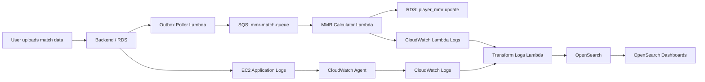

# 실 서비스 운영 로그 대시보드화 발표 흐름

## 1. 발표 한 줄 소개

이번 프로젝트는 MMR 서비스의 운영 로그를 EC2, Lambda, RDS, SQS, CloudWatch, OpenSearch로 연결해서 실시간에 가깝게 수집하고, 장애 원인과 처리 흐름을 대시보드에서 확인할 수 있게 만든 로그 파이프라인입니다.

## 2. 서비스 구조

사용자가 게임 match data를 업로드하면 백엔드/RDS 쪽에서 처리 대상 데이터를 만들고, outbox poller가 이를 SQS에 넣습니다. 이후 `de-ai-01-mmr-mmr-calculator` Lambda가 SQS 메시지를 한 건씩 받아 MMR 계산을 수행합니다.



## 3. 구현한 로그 파이프라인

### EC2 애플리케이션 로그

- EC2 인스턴스에 IAM instance profile을 연결했습니다.
- SSM Agent를 설치해서 SSH 없이도 인스턴스 상태와 명령 실행을 관리할 수 있게 했습니다.
- CloudWatch Agent를 설치하고 애플리케이션 로그를 CloudWatch Logs로 전송했습니다.
- DB poller와 alert evaluator를 cron으로 등록해서 주기적으로 로그를 수집하고 평가하도록 구성했습니다.

### Lambda 오류 로그

- `de-ai-01-mmr-mmr-calculator`
- `de-ai-01-mmr-outbox-poller`

위 Lambda들의 CloudWatch Logs subscription을 `mmr-transform-logs` Lambda에 연결했습니다.

`mmr-transform-logs`는 Lambda 로그를 파싱해서 다음 필드를 OpenSearch 문서로 정규화합니다.

- `source_log=lambda`
- `service=Lambda function name`
- `level=ERROR`
- `event_type=lambda_error`
- `error_name`
- `request_id`
- `message`
- `meta.lambda_function`

단, `mmr-transform-logs` 자기 자신의 로그는 subscription 대상에서 제외했습니다. 자기 로그를 다시 자기 자신이 처리하면 재귀 호출이 생길 수 있기 때문입니다.

### OpenSearch 저장 및 시각화

- OpenSearch domain: `gmok-log-search`
- Index pattern: `gmok-back-logs-*`
- Dashboards endpoint: OpenSearch Dashboards

대시보드에는 기존 백엔드 운영 로그와 함께 10번 패널을 추가했습니다.

10번 패널:

- 이름: `10 Lambda Failure Logs`
- 필터: `source_log:lambda and level:ERROR`
- 주요 컬럼: `service`, `error_name`, `message`, `request_id`

이 패널을 통해 Lambda 실패 로그를 함수별, 에러명별, 요청 ID별로 확인할 수 있습니다.

## 4. SQS와 DLQ 설명 포인트

`mmr-calculator` Lambda 앞에는 SQS가 있습니다. Lambda가 SQS 메시지를 성공적으로 처리하면 메시지는 큐에서 삭제됩니다.

반대로 다음 상황에서는 메시지가 재시도됩니다.

- Lambda 코드에서 exception 발생
- Lambda timeout 발생
- batch item failure로 해당 메시지를 실패 처리
- Lambda가 정상 응답하지 못함

재시도가 계속 실패해서 SQS의 `maxReceiveCount`를 넘으면 해당 메시지는 DLQ로 이동합니다.

중요한 점은, Lambda에 `ERROR` 로그가 찍혔다고 해서 무조건 DLQ로 가는 것은 아닙니다. 실패 후 재시도에서 성공하면 DLQ에는 남지 않고, OpenSearch에는 실패 로그만 남을 수 있습니다.

## 5. 실제 관측된 오류

실제 `mmr-calculator`에서 관측된 대표 오류는 다음과 같습니다.

- `psycopg.errors.DeadlockDetected`
- `KeyError`
- `AppError`

특히 발표에서 강조할 만한 실제 운영 이슈는 RDS 업데이트 중 발생한 deadlock입니다.

예시:

```text
DB UPDATE failed: deadlock detected while updating player_mmr
```

이 로그는 단순 API 실패가 아니라 MMR 계산 과정에서 DB transaction 충돌이 발생했음을 보여줍니다. 즉, 대시보드를 통해 애플리케이션 코드 오류뿐 아니라 DB 동시성 문제까지 추적할 수 있습니다.

## 6. 발표 영상 시연 흐름

### Step 1. OpenSearch Dashboards 접속

OpenSearch Dashboards에 접속해서 전체 운영 로그 대시보드를 보여줍니다.

처음에는 다음을 보여줍니다.

- 전체 로그 수
- 시간대별 에러 추이
- API status code 분포
- service별 로그 분포

### Step 2. API 운영 로그 생성

발표용 API 트래픽 스크립트를 실행합니다.

```powershell
.\log-pipeline\scripts\run_dashboard_public_api_traffic.ps1
```

주의:

- guild 관련 API 호출은 제외했습니다.
- 불안정한 `guild`, `guildMember`, `gmokGuilds` 계열 호출 없이 health, auth, replay 계열 중심으로 로그를 생성합니다.

대시보드에서 API 호출 로그가 새로 들어오는지 확인합니다.

### Step 3. Lambda 오류 로그 확인

10번 패널 `Lambda Failure Logs`를 보여줍니다.

필터:

```text
source_log:lambda and level:ERROR
```

이 화면에서 다음을 설명합니다.

- 어떤 Lambda에서 오류가 났는지
- 어떤 `error_name`인지
- 어떤 request_id와 연결되는지
- 실제 메시지가 무엇인지

### Step 4. 발표용 Lambda 오류 데이터 생성

실제 Lambda 호출로 오류를 유발할 수 있습니다.

```powershell
.\log-pipeline\scripts\trigger_lambda_error_demo.ps1 -Scenario missing_custom_match_id
```

또는 발표 화면을 안정적으로 만들기 위해 OpenSearch에 발표용 오류 문서를 직접 seed할 수 있습니다.

```powershell
.\log-pipeline\scripts\seed_lambda_error_demo.ps1
```

이 seed 데이터는 다양한 `error_name`을 보여주기 위한 발표용 데이터입니다.

예시 에러명:

- `AppError`
- `KeyError`
- `psycopg.errors.DeadlockDetected`
- `psycopg.OperationalError`
- `TimeoutError`
- `ValueError`

### Step 5. 장애 분석 흐름 설명

대시보드에서 특정 오류를 클릭하거나 필터링한 뒤 다음 순서로 설명합니다.

1. 특정 시간대에 Lambda 오류 증가
2. 10번 패널에서 `service`와 `error_name` 확인
3. `request_id`로 같은 실행의 로그를 추적
4. 메시지에서 원인 확인
5. SQS 재시도 또는 DLQ 이동 가능성 설명
6. DB deadlock이면 RDS transaction 충돌 문제로 해석

## 7. 발표에서 강조할 스페셜 포인트

### 1. EC2를 삭제 후 재생성해도 복구 가능한 구조

EC2를 새로 만들었지만 IAM profile, SSM Agent, CloudWatch Agent, cron, pipeline env를 다시 설정해서 로그 파이프라인을 복구했습니다.

이 점은 운영 환경에서 인스턴스 교체가 발생해도 로그 수집 체계를 재구성할 수 있음을 보여줍니다.

### 2. Lambda 로그까지 OpenSearch로 통합

기존에는 EC2/백엔드 로그 중심이었지만, Lambda CloudWatch Logs subscription을 추가해서 serverless 처리 실패까지 같은 대시보드에서 볼 수 있게 했습니다.

### 3. DLQ와 Lambda ERROR를 구분

대시보드의 Lambda 오류는 CloudWatch ERROR 로그입니다. DLQ 메시지와는 다릅니다.

이 구분이 중요합니다.

- Lambda ERROR: 처리 중 오류가 발생했다는 실행 로그
- DLQ: 재시도까지 모두 실패해서 최종 격리된 메시지

따라서 대시보드는 “장애가 발생한 흔적”을 빠르게 보여주고, DLQ는 “처리 실패가 최종 확정된 메시지”를 보여줍니다.

### 4. 실제 운영 이슈인 DB deadlock을 시각화

`player_mmr` 업데이트 중 발생한 deadlock을 OpenSearch에서 확인할 수 있게 했습니다. 발표에서 이 부분은 단순 로그 수집이 아니라 실제 장애 분석에 연결되는 포인트입니다.

### 5. 불안정한 guild API 제외

서비스 제공자의 요청에 따라 guild 관련 API 호출은 발표용 트래픽 생성에서 제외했습니다.

제외한 계열:

- `guild`
- `guildMember`
- `gmokGuilds`
- `demo-guild`

대신 health, auth, replay 중심으로 안정적인 시연 흐름을 만들었습니다.

## 8. 발표 멘트 예시

이번 프로젝트의 핵심은 운영 로그를 단순히 저장하는 것이 아니라, 장애를 추적할 수 있는 형태로 정규화하고 대시보드화한 것입니다.

사용자가 match data를 업로드하면 처리 요청은 SQS에 쌓이고, MMR Calculator Lambda가 이를 비동기로 처리합니다. 이때 Lambda에서 발생하는 오류, EC2 애플리케이션 로그, DB 기반 오류 로그가 모두 CloudWatch와 transform Lambda를 거쳐 OpenSearch에 저장됩니다.

대시보드 10번 패널에서는 Lambda 실패 로그를 별도로 볼 수 있습니다. 여기서 어떤 함수에서 어떤 에러가 났는지, request_id가 무엇인지, 메시지가 무엇인지 확인할 수 있습니다.

특히 실제로는 `player_mmr` 업데이트 과정에서 deadlock 오류가 관측되었습니다. 이처럼 대시보드는 단순 로그 목록이 아니라 운영자가 장애 원인을 빠르게 좁혀갈 수 있는 분석 화면 역할을 합니다.

## 9. 시연 체크리스트

- OpenSearch Dashboards 접속 가능 여부 확인
- `gmok-back-logs-*` index pattern 확인
- 10번 패널 `Lambda Failure Logs` 확인
- API 트래픽 스크립트 실행
- guild 관련 API 호출이 빠져 있는지 확인
- Lambda 오류 seed 또는 trigger 스크립트 실행
- `source_log:lambda and level:ERROR` 필터로 Lambda 오류 확인
- `error_name` 종류가 여러 개 보이는지 확인
- `psycopg.errors.DeadlockDetected` 로그를 실제 운영 오류 사례로 설명

