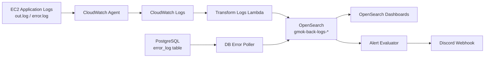

# 운영 로그 관측 파이프라인

이 프로젝트는 기존에 파일로만 저장되던 백엔드 운영 로그를 수집, 정규화, 적재, 시각화하는 로그 관측 파이프라인입니다.

기존 방식에서는 EC2 서버의 `out.log`, `error.log` 파일이나 DB의 `error_log` 테이블을 직접 확인해야 했습니다. 로그는 남아 있었지만 장애가 발생했을 때 검색, 집계, 원인 추적, 알림으로 바로 이어지기 어려웠습니다.

이 프로젝트는 그 로그들을 CloudWatch와 Lambda를 거쳐 OpenSearch에 적재하고, OpenSearch Dashboards에서 요청량, 지연시간, 상태 코드, 에러 원인을 한 화면에서 확인할 수 있도록 구성합니다.

## 프로젝트 목표

- EC2 애플리케이션 로그를 CloudWatch Logs로 수집합니다.
- CloudWatch Logs subscription으로 Lambda를 호출합니다.
- Lambda가 문자열 로그를 검색 가능한 구조화 문서로 정규화합니다.
- PostgreSQL `error_log` 테이블의 상세 에러도 주기적으로 수집합니다.
- 정규화된 로그를 OpenSearch `gmok-back-logs-*` 인덱스에 저장합니다.
- OpenSearch Dashboards에서 운영 상태와 장애 원인을 시각화합니다.
- 조건에 따라 Discord 알림을 보낼 수 있도록 구성합니다.

## 기존 방식의 문제

기존 운영 로그는 파일 저장 중심이었습니다.

```text
EC2 서버
  └─ logs/out.log
  └─ logs/error.log
```

이 방식은 로그를 남기는 데는 충분하지만 운영 관측에는 한계가 있습니다.

- 에러가 여러 줄 stack trace로 나뉘어 하나의 이벤트로 보기 어렵습니다.
- 특정 시간대, route, status code, error code 기준으로 집계하기 어렵습니다.
- 장애가 발생해도 파일을 직접 열어보기 전까지 빠르게 인지하기 어렵습니다.
- EC2 로그, Lambda 로그, DB 에러 로그가 서로 다른 위치에 흩어져 있습니다.

그래서 단순 파일 저장이 아니라 `수집 -> 정규화 -> 검색/집계 -> 대시보드/알림`으로 이어지는 운영 데이터 파이프라인이 필요했습니다.

## 전체 흐름



## 핵심 구성

### 1. CloudWatch Agent

EC2에 남는 애플리케이션 로그 파일을 CloudWatch Logs로 전송합니다.

대상 로그 예시는 다음과 같습니다.

```text
/home/ec2-user/deploy/back/logs/out.log
/home/ec2-user/deploy/back/logs/error.log
```

관련 파일:

```text
log-pipeline/cloudwatch/amazon-cloudwatch-agent.json
```

### 2. Transform Logs Lambda

CloudWatch Logs subscription으로 호출되는 Lambda입니다. 파일 로그나 Lambda 로그를 받아 OpenSearch에 넣기 좋은 공통 스키마로 변환합니다.

관련 파일:

```text
log-pipeline/lambda/transform_logs/handler.py
```

예를 들어 기존 로그가 다음처럼 문자열 중심이었다면:

```text
2026-04-18T14:00:57: fetchUserGuilds service error
SystemError: Failed to fetch Discord guilds
    at DiscordMemberGuildService.fetchUserGuilds (...)
    status: 500, type: system-error
```

Lambda는 이를 다음과 같은 구조화 문서로 바꿉니다.

```json
{
  "@timestamp": "2026-04-18T05:00:57Z",
  "level": "ERROR",
  "service": "gmok-back",
  "source_log": "error",
  "event_type": "exception",
  "message": "fetchUserGuilds service error",
  "raw": {
    "lines": ["..."]
  }
}
```

이렇게 변환하면 OpenSearch에서 시간, 로그 레벨, 서비스, route, status code, error code 기준으로 검색하고 집계할 수 있습니다.

### 3. DB error_log Poller

파일 로그와 별개로 PostgreSQL `error_log` 테이블에 저장된 에러 이벤트를 수집합니다.

관련 파일:

```text
log-pipeline/scripts/poll_error_log.mjs
```

이 스크립트는 DB row를 읽어 OpenSearch 문서로 변환합니다. `source_log=db_error_log`, `event_type=error_event`로 저장되기 때문에 파일 로그와 DB 기반 에러를 구분해서 볼 수 있습니다.

중복 수집을 막기 위해 checkpoint 파일을 사용합니다.

### 4. OpenSearch

정규화된 로그는 날짜별 인덱스에 저장됩니다.

```text
gmok-back-logs-YYYY-MM-DD
```

인덱스 템플릿은 필드 타입을 미리 정의합니다.

관련 파일:

```text
log-pipeline/opensearch/index-template.json
```

대표 필드는 다음과 같습니다.

```text
@timestamp
level
service
environment
source_log
event_type
message
route
method
status_code
latency_ms
client_ip
error_name
error_message
error_code
severity
meta
raw
```

### 5. OpenSearch Dashboards

OpenSearch에 저장된 로그를 시각화합니다.

관련 파일:

```text
log-pipeline/opensearch/dashboard.ndjson
```

대시보드는 크게 세 영역으로 구성됩니다.

#### Traffic & Latency

- Requests per Minute
- Route Latency Detail
- Instance Health Detail

서비스 요청량과 지연시간을 확인합니다.

#### HTTP Status

- Status Distribution
- Status Code Detail
- Route × Status Breakdown

HTTP 상태 코드 분포와 route별 실패 흐름을 확인합니다.

#### Error Analysis

- Structured Error Summary
- DB error_log Trend
- Raw error.log Messages

구조화된 에러 요약과 원문 로그를 함께 확인합니다. 집계 화면에서 문제 범위를 좁힌 뒤, Discover에서 원문 stack trace까지 추적할 수 있습니다.

### 6. Alert Evaluator

OpenSearch 문서를 조회해 운영 알림 조건을 평가합니다.

관련 파일:

```text
log-pipeline/scripts/evaluate_alerts.py
```

대표 알림 조건은 다음과 같습니다.

- 5xx 응답이 일정 수 이상 반복되는 경우
- 같은 에러 메시지가 반복되는 경우
- p95 latency가 기준보다 높은 경우
- DB error_log 이벤트가 증가하는 경우
- OpenSearch 조회 자체가 실패하는 경우

알림은 Discord webhook으로 전송할 수 있습니다.

## 결과 화면

아래 이미지는 이 파이프라인을 통해 OpenSearch Dashboards와 Discord 알림에서 확인할 수 있는 결과 예시입니다.

### OpenSearch Dashboard: 트래픽과 상태 코드

요청량, route별 지연시간, HTTP status code 분포를 한 화면에서 확인할 수 있습니다. 파일 로그를 직접 열어보는 대신, 운영자가 시간대별 요청 흐름과 실패 비율을 빠르게 파악할 수 있습니다.

.png>)

### OpenSearch Dashboard: 구조화 에러와 DB error_log 추세

정규화된 에러 메시지, route, status code, severity, 발생 횟수를 집계합니다. DB `error_log` 테이블에서 수집한 이벤트도 시간대별 추세로 볼 수 있어 파일 로그와 DB 기반 에러를 함께 분석할 수 있습니다.

.png>)

### OpenSearch Dashboard: 원문 로그와 Lambda 실패 추적

정규화된 집계 화면에서 끝나지 않고, 원문 `error.log` 메시지와 Lambda 실패 로그까지 이어서 확인할 수 있습니다. Lambda function, error name, message, request id를 기준으로 장애 실행을 추적할 수 있습니다.

.png>)

### Discord 알림

`evaluate_alerts.py`가 OpenSearch 문서를 조회해 반복 에러를 감지하면 Discord webhook으로 알림을 보냅니다. 알림에는 route, status, 발생 횟수, error name, dashboard Discover 링크가 포함되어 운영자가 바로 원인 분석 화면으로 이동할 수 있습니다.

.png>)

## 디렉터리 구조

```text
log-pipeline/
  cloudwatch/
    amazon-cloudwatch-agent.json
  config/
    pipeline.env.example
  lambda/
    transform_logs/
      handler.py
  opensearch/
    index-template.json
    dashboard.ndjson
  scripts/
    poll_error_log.mjs
    evaluate_alerts.py
  deploy/
    aws/
    ec2/

infra/
  opensearch-terraform/

archive/
  terraform_setting-main/
  backend-dist/
```

## 로컬 검증

CloudWatch/파일 로그 정규화:

```powershell
python log-pipeline\lambda\transform_logs\handler.py `
  log-pipeline\samples\raw\prefixed-json.log `
  log-pipeline\samples\normalized\normalized-prefixed-json.json
```

DB `error_log` 샘플 정규화:

```powershell
node log-pipeline\scripts\poll_error_log.mjs `
  --sample-input log-pipeline\samples\raw\error_log_rows.json `
  --output log-pipeline\samples\normalized\normalized-error-events.json
```

정규화된 로그 기준 알림 평가:

```powershell
python log-pipeline\scripts\evaluate_alerts.py `
  log-pipeline\samples\normalized\normalized-prefixed-json.json `
  log-pipeline\samples\normalized\normalized-error-events.json
```

## OpenSearch 인프라

OpenSearch 전용 Terraform은 아래 경로에 있습니다.

```text
infra/opensearch-terraform/
```

기본 실행:

```powershell
cd infra\opensearch-terraform
terraform init
terraform plan
terraform apply
```

생성되는 주요 output:

```text
endpoint
dashboards_endpoint
bulk_url
search_url
```

## 운영 환경변수

환경변수 예시는 아래 파일을 참고합니다.

```text
log-pipeline/config/pipeline.env.example
```

주요 값:

```text
OPENSEARCH_BULK_URL
OPENSEARCH_SEARCH_URL
OPENSEARCH_USERNAME
OPENSEARCH_PASSWORD
DISCORD_WEBHOOK_URL
DASHBOARD_URL
```

실제 운영 값이 들어 있는 `pipeline.env`, `.env`, `terraform.tfvars`, `terraform.tfstate` 파일은 커밋하지 않습니다.

## 이 프로젝트의 핵심

이 프로젝트의 핵심은 로그를 단순히 저장하는 것이 아니라, 장애 분석에 바로 사용할 수 있는 운영 데이터로 바꾸는 것입니다.

기존에는 `error.log` 파일을 직접 열어 원인을 찾아야 했습니다. 이제는 Lambda가 로그를 정규화하고 OpenSearch가 이를 검색 가능한 문서로 저장합니다. 운영자는 Dashboard에서 요청량, 지연시간, 상태 코드, 에러 원인을 확인하고, 필요한 경우 Discover에서 원문 로그와 stack trace까지 추적할 수 있습니다.

즉, 이 프로젝트는 파일 저장 중심의 로그 운영을 OpenSearch 기반 관측 파이프라인으로 확장한 작업입니다.
