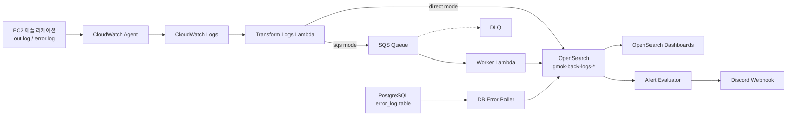

# Log Pipeline

EC2 애플리케이션 로그와 PostgreSQL `error_log` 데이터를 수집해 OpenSearch에 적재하고, OpenSearch Dashboards와 Discord 알림으로 운영 상태를 확인하는 로그 관측 파이프라인입니다.

기존에는 서버의 `out.log`, `error.log` 파일이나 DB 테이블을 직접 확인해야 했습니다. 이 프로젝트는 흩어진 로그를 공통 스키마로 정규화해 검색, 집계, 대시보드, 알림까지 이어지도록 구성했습니다.

## 데이터 흐름



## 구현한 것

- EC2 로그 파일을 CloudWatch Logs로 전송하는 CloudWatch Agent 설정
- CloudWatch Logs subscription으로 호출되는 로그 변환 Lambda
- `out.log`, `error.log`, Lambda 로그를 OpenSearch 문서 구조로 정규화
- PostgreSQL `error_log` 테이블을 주기적으로 읽는 DB poller
- OpenSearch 일자별 인덱스(`gmok-back-logs-YYYY-MM-DD`)와 index template
- OpenSearch Bulk API 적재 및 대량 로그 chunking
- OpenSearch 장애나 부분 실패에 대비한 SQS / DLQ 기반 적재 모드
- 중복 적재를 줄이기 위한 문서 ID/checkpoint 처리
- 운영 지표 확인용 OpenSearch Dashboard
- 5xx 반복, 동일 에러 반복, p95 latency 초과, DB error 증가 등을 감지하는 alert evaluator
- Discord webhook 알림
- AWS 리소스 구성 및 배포 보조 스크립트

## 주요 파일

```text
log-pipeline/
  cloudwatch/amazon-cloudwatch-agent.json
  lambda/transform_logs/handler.py
  scripts/poll_error_log.mjs
  scripts/evaluate_alerts.py
  opensearch/index-template.json
  opensearch/dashboard.ndjson
  config/pipeline.env.example
  deploy/aws/setup_aws_resources.ps1
  deploy/ec2/

infra/opensearch-terraform/
tests/test_transform_logs_large_batch.py
```

## 결과 화면

### OpenSearch Dashboard - 트래픽과 상태 코드

요청량, route별 latency, HTTP status code 분포를 한 화면에서 확인할 수 있습니다.

.png>)

### OpenSearch Dashboard - 구조화된 에러와 DB error_log 추세

정규화된 에러 메시지, route, status code, severity, DB `error_log` 이벤트 추세를 함께 확인할 수 있습니다.

.png>)

### OpenSearch Dashboard - 원문 로그와 Lambda 실패 추적

집계 화면에서 끝나지 않고 원문 `error.log`, stack trace, Lambda 실패 로그까지 추적할 수 있습니다.

.png>)

### Discord 알림

반복 에러나 임계치를 넘는 운영 이벤트를 Discord webhook으로 전송합니다.

.png>)

## 정리

이 프로젝트는 파일과 DB에 흩어져 있던 운영 로그를 OpenSearch 기반 관측 파이프라인으로 바꾼 작업입니다. 로그 수집, 정규화, 적재, 대시보드, 알림까지 연결해 장애 원인과 운영 상태를 빠르게 확인할 수 있도록 만들었습니다.
