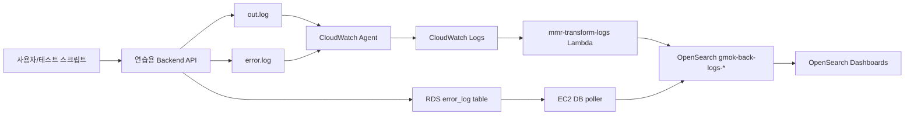

# GMOK 로그 파이프라인 전체 Flow 정리

이 문서는 발표와 인수인계를 위해 GMOK 로그 파이프라인의 전체 흐름, 데이터 변화 과정, 대시보드 확인 포인트를 한 번에 정리한 문서입니다.

## 1. 프로젝트 목적

GMOK 백엔드에서 발생하는 요청 로그, 에러 로그, DB `error_log` 데이터를 수집해 OpenSearch에 적재하고, OpenSearch Dashboards에서 운영 상태와 장애 원인을 시각적으로 확인하는 것이 목표입니다.

핵심 가치는 다음과 같습니다.

- 요청량, 지연 시간, HTTP 상태 코드를 통해 서비스 상태를 빠르게 파악합니다.
- 4xx/5xx를 정확한 status code 단위로 구분해 클라이언트 문제와 서버 문제를 분리합니다.
- DB `error_log`의 `error_message`, `route`, `status_code`, `severity`를 시각화해 어떤 오류가 반복되는지 확인합니다.
- CloudWatch `error.log` 원문도 별도 패널로 확인해 구조화되지 않은 로그까지 추적할 수 있게 합니다.

## 2. 기준 환경

실제 운영 서비스인 `dev-api.gmok.kr`가 아니라, 파이프라인 검증용으로 배포된 연습용 EC2/RDS 환경을 기준으로 테스트합니다.

```text
Region: eu-central-1
OpenSearch domain: gmok-log-search
Lambda: mmr-transform-logs
EC2 instance: i-09fc20acb21d5618d
Backend public URL: http://52-59-124-66.nip.io:19901
Backend Swagger URL: http://52-59-124-66.nip.io:19901/docs/
Backend internal URL: http://127.0.0.1:19901
RDS database: mmrdb
```

비밀번호, 세션 쿠키, Terraform state/tfvars 등 민감 정보는 문서에 직접 기록하지 않습니다.

## 3. 전체 서비스 Flow



## 4. 데이터 수집 경로

### 4.1 Backend 파일 로그 경로

백엔드 API가 호출되면 EC2 내부의 로그 파일에 기록됩니다.

```text
/home/ec2-user/deploy/back/logs/out.log
/home/ec2-user/deploy/back/logs/error.log
```

CloudWatch Agent가 이 파일들을 tailing하여 CloudWatch Logs로 전송합니다.

```text
/gmok/dev/back/out
/gmok/dev/back/error
```

CloudWatch Logs subscription filter가 `mmr-transform-logs` Lambda를 호출하고, Lambda가 로그를 정규화해 OpenSearch `_bulk` API로 적재합니다.

### 4.2 DB error_log 경로

백엔드가 DB `error_log` 테이블에 기록한 오류는 EC2의 DB poller가 주기적으로 조회합니다.

```text
RDS error_log
-> scripts/poll_error_log.mjs
-> OpenSearch gmok-back-logs-*
```

이 경로의 데이터는 `error_code`, `error_name`, `error_message`, `route`, `status_code`, `severity` 같은 구조화된 필드를 가지므로, 대시보드에서 오류 원인 분석에 가장 적합합니다.

## 5. 데이터 변화 과정

### 5.1 API 요청 로그

원천 데이터는 백엔드 access log 형태입니다.

```text
GET /api/health 200 1.23ms
POST /api/replays/ 400 12.45ms
```

Lambda 정규화 후 OpenSearch 문서는 다음과 같은 형태가 됩니다.

```json
{
  "@timestamp": "2026-04-30T13:32:27Z",
  "source_log": "out",
  "event_type": "http_request",
  "route": "/api/health",
  "method": "GET",
  "status_code": 200,
  "latency_ms": 1.23,
  "instance_id": "i-09fc20acb21d5618d",
  "instance_name": "ip-10-0-1-138.eu-central-1.compute.internal"
}
```

대시보드에서는 요청량, route별 latency, status code 분포, instance별 상태로 시각화됩니다.

### 5.2 파일 기반 error.log

원천 데이터는 구조화되지 않은 stderr/application 로그입니다.

```text
status: 500,
detail: '오류가 발생했습니다. 오류 추적 번호: ERR-260430-zb5Z68',
```

이 데이터는 `error_code`, `error_name`이 항상 존재하지 않습니다. 따라서 `no_error_code`, `unknown_error` 같은 버킷으로 묶으면 원인 파악이 어렵습니다.

현재 대시보드에서는 이 데이터를 `09 Raw error.log Messages` 패널로 분리해 `message.keyword`, `event_type`, `instance_name` 기준으로 확인합니다.

### 5.3 DB error_log

원천 데이터는 RDS `error_log` 테이블의 행입니다.

```text
error_code=ERR-260430-BgpgtK
error=Database connection failed
request=/api/test/error/database
severity=error
status=500
```

DB poller 정규화 후 OpenSearch 문서는 다음과 같은 형태가 됩니다.

```json
{
  "@timestamp": "2026-04-30T13:32:27.759Z",
  "source_log": "db_error_log",
  "event_type": "error_event",
  "error_code": "ERR-260430-BgpgtK",
  "error_name": "Error",
  "error_message": "Database connection failed",
  "route": "/api/test/error/database",
  "status_code": 500,
  "severity": "error",
  "instance_name": "mmr-backend-ec2"
}
```

대시보드에서는 `04 Structured Error Summary`와 `05 DB error_log Trend`에서 확인합니다.

## 6. OpenSearch 저장 구조

OpenSearch index pattern은 다음과 같습니다.

```text
gmok-back-logs-*
```

주요 필드는 다음과 같습니다.

| 필드 | 의미 | 사용 패널 |
| --- | --- | --- |
| `@timestamp` | 이벤트 발생 시각 | 전체 시간 필터, trend |
| `source_log` | `out`, `error`, `db_error_log` 구분 | Discover, 에러 패널 |
| `event_type` | `http_request`, `error_event`, `exception` 등 | 요청/에러 필터 |
| `route` | API route | latency, status, error summary |
| `status_code` | HTTP status code | status 분석 |
| `latency_ms` | 요청 처리 시간 | latency 분석 |
| `error_message.keyword` | 사람이 읽을 수 있는 오류 메시지 | structured error summary |
| `error_code` | 오류 추적 번호 | 상세 추적용 |
| `severity` | `error`, `warning` 등 | DB error trend |
| `instance_name` | 로그 발생 인스턴스 | instance health |

## 7. Dashboard 구성

Import 파일은 다음 위치에 있습니다.

```text
opensearch/dashboard.ndjson
```

Dashboard 이름:

```text
GMOK Log Observability Dashboard
```

패널 구성:

| 번호 | 패널 | 목적 |
| --- | --- | --- |
| 01 | Requests per Minute | 시간대별 요청량 확인 |
| 02 | Route Latency Detail | route별 평균/p95 지연 시간 확인 |
| 03 | HTTP Status Distribution | 2xx/3xx/4xx/5xx 범위 비율 확인 |
| 04 | Structured Error Summary | 오류 메시지, route, status, severity 기준 원인 확인 |
| 05 | DB error_log Trend | DB error_log 발생 추이와 severity 확인 |
| 06 | Instance Health Detail | 인스턴스별 요청/상태/latency 확인 |
| 07 | HTTP Status Code Detail | 400, 401, 403, 500 등 정확한 status code 확인 |
| 08 | Route x Status Breakdown | route별 status code 반복 패턴 확인 |
| 09 | Raw error.log Messages | 구조화되지 않은 error.log 원문 메시지 확인 |

## 8. 발표용 시나리오

### 8.1 정상 요청 발생

```text
GET /api/health
GET /api/guilds/?limit=2
GET /api/auth/me
```

확인 패널:

- `01 Requests per Minute`
- `02 Route Latency Detail`
- `06 Instance Health Detail`

### 8.2 클라이언트 오류 유도

```text
POST /api/replays/ 400
GET /api/replays/bad-guild-id?limit=abc 400
```

확인 패널:

- `03 HTTP Status Distribution`
- `07 HTTP Status Code Detail`
- `08 Route x Status Breakdown`

### 8.3 서버/DB 오류 유도

테스트용 API 또는 스크립트로 에러를 발생시킵니다.

```powershell
.\scripts\run_dashboard_public_api_traffic.ps1 -SessionUid "YOUR_SESSION_UID" -Repeat 3
```

확인 패널:

- `04 Structured Error Summary`
- `05 DB error_log Trend`
- `09 Raw error.log Messages`

예상되는 오류 요약 예시:

```text
This is a test error for logging system | /api/test/error/generic | 500 | error
Database connection failed | /api/test/error/database | 500 | error
Unknown error | /api/test/error/validation | 400 | warning
```

## 9. OpenSearch 재생성 시 복구 Flow

OpenSearch를 삭제 후 재생성하면 endpoint가 바뀌므로 다음 작업이 필요합니다.

1. Terraform으로 OpenSearch domain 생성
2. 새 endpoint 확인
3. Lambda `mmr-transform-logs` 환경변수 갱신
   - `OPENSEARCH_BULK_URL`
   - `OPENSEARCH_USERNAME`
   - `OPENSEARCH_PASSWORD`
4. EC2 DB poller 환경파일 갱신
   - `/opt/gmok-log-pipeline/config/pipeline.env`
5. OpenSearch index template 재등록
   - `opensearch/index-template.json`
6. Dashboard import
   - `opensearch/dashboard.ndjson`
7. 테스트 트래픽 발생 후 Dashboard 확인

자세한 명령어는 `opensearch/recreate-runbook.md`를 참고합니다.

## 10. 운영 관점에서의 해석 기준

### 10.1 status code 해석

범위형 패널은 전체 상태를 빠르게 보는 용도입니다.

```text
2xx: 정상 응답
4xx: 요청/인증/권한/입력 문제
5xx: 서버 내부 오류
```

정확한 원인 분석은 `07 HTTP Status Code Detail`과 `08 Route x Status Breakdown`에서 확인합니다.

### 10.2 error_code 해석

`error_code`는 사람이 읽는 오류명이 아니라 개별 오류를 추적하기 위한 번호입니다. 따라서 대시보드의 1차 분석 기준으로는 적합하지 않습니다.

원인 분석 우선순위:

```text
error_message
-> route
-> status_code
-> severity
-> error_code
```

### 10.3 no_error_code / unknown_error 문제

파일 기반 `source_log:error`는 구조화되지 않은 로그라 `error_code`, `error_name`이 없는 경우가 정상입니다. 이 데이터를 error code 기준으로 묶으면 `no_error_code`, `unknown_error`가 크게 보이지만 실제 원인을 알 수 없습니다.

그래서 현재 대시보드는 다음처럼 분리했습니다.

```text
DB error_log: 04 Structured Error Summary
파일 error.log: 09 Raw error.log Messages
```

## 11. 최종 확인 체크리스트

- OpenSearch Dashboards 접속 가능
- `gmok-back-logs-*` data view 존재
- 시간 범위 `Last 24 hours` 또는 `Last 1 hour` 설정
- `01 Requests per Minute`에 요청량 표시
- `07 HTTP Status Code Detail`에 400/403/500 등 정확한 코드 표시
- `04 Structured Error Summary`에 사람이 읽을 수 있는 오류 메시지 표시
- `05 DB error_log Trend`에 DB error_log 추이 표시
- `09 Raw error.log Messages`에 파일 기반 error.log 메시지 표시
- 새 OpenSearch 생성 후 Lambda와 EC2 poller endpoint가 모두 갱신됨

